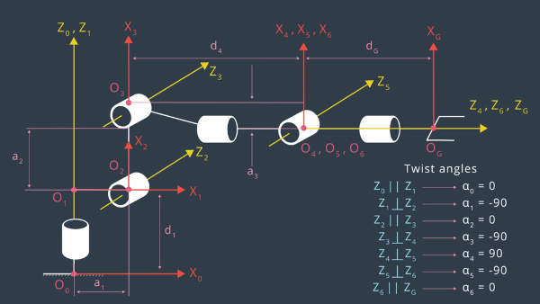
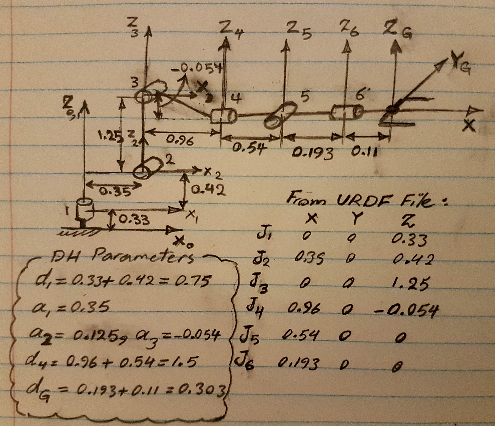
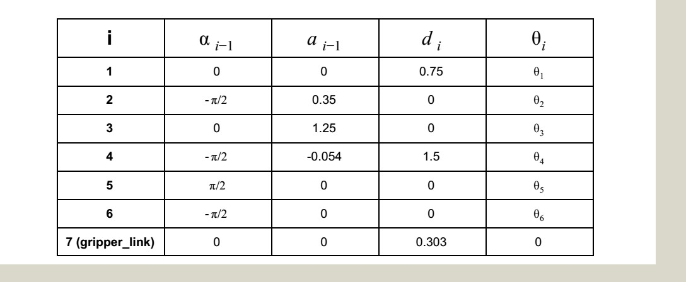
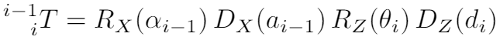
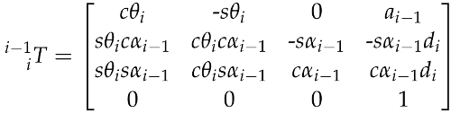
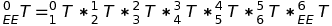
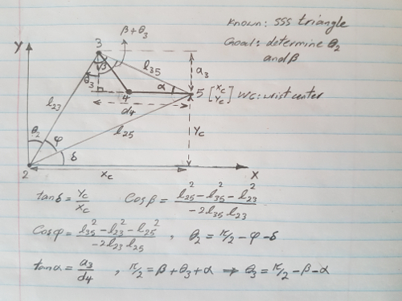

# Robotic Arm/ Kuka KR210 - Pick & Place Project


## Kinematic Analysis
The kinematics of the KUKA KR210 robotic arm which comprises of six rotational degrees of freedom as a antropomorphic manipulator.

The task is to solve the forward and inverse kinematics problems.

The forward kinematics: to find the end-effector pose given the values for the generalized coordinates.
The inverse kinematics: to find the configuration of generalized coordinates that results in the requested end-effector pose.
The KR210 manipulator is designed as a spherical wrist. The last three degrees of freedom have rotational axes that intersect at a common point, the wrist center. This mechanism leads to a big advantage that it kinematically decouples the position and orientation of the end effector. The decoupling simplifies the inverse kinematics problem, since instead of solving twelve nonlinear equations simultaneously (one equation for each term in the first three rows of the overall homogeneous transform matrix), it is now possible to independently solve two simpler problems:

a- find the Cartesian coordinates of the wrist center (inverse position) <br>
b- find the composition of rotations to orient the end-effector (inverse orientation).

### 1. Run the forward_kinematics demo and evaluate the kr210.urdf.xacro file to perform kinematic analysis of Kuka KR210 robot and derive its DH parameters.

To do FK and IK, we are using a modified method by Jacques Denavit and Richard Hartenberg which requires only four parameters for each reference frame.

[//]: # (use HTML for picture with resizing)


Subsequent frames are connected by a homogeneous transformation ``T``. The transformation from frame ``i-1`` to frame ``i`` is characterized by four parameters,

1. twist angle ``alpha_(i-1)``,
2. link length ``a_(i-1)``,
3. link offset ``d_i``,
4. joint angle ``theta_i``.


The DH parameters of a and d (above picture) for the DH table can be derived from URDF file. The joint positions in the following sketch was extracted from the kuka-kr210 URDF.xacro. So, the DH parameters (a and d) were calculated from the joint positions in URDF format in the following sketch. 




Therefore, following are DH parameters used specifically in this project:


### 2. Using the DH parameter table you derived earlier, create individual transformation matrices about each joint. In addition, also generate a generalized homogeneous transform between `base_link` and `gripper_link` using only end-effector (gripper) pose.

Homogenous transforms including rotation and translation between two neighbor joints can be represented by the following formula based on DH parameters. Each transformation matrix looks like this:

 


I used this as a template to calculate the individual transformation matrices and then by multiplying them to calculate the overall transformation matrix as follows:

 [eq. 1]

### 3. Decouple Inverse Kinematics problem into Inverse Position Kinematics and inverse Orientation Kinematics; doing so derive the equations to calculate all individual joint angles.

The three joints 4, 5 and 6 of the robot arm KR210 are revolute. They constitute a spherical wrist since their axes intersect at a single point, the wrist center at joint 5. So the inverse kinematics problem is decoupled into the position problem for the wrist center and the orientation problem for the end effector. <br>

### 1. Inverse Position:

The main loop in the code where the inverse kinematics are calculated for each of the requested poses. The first step is to calculate the wrist centre (WC) position. The first sub-step is to construct R0_6 based on the target roll, pitch and yaw angles requested of the end effector. This is done by first rotating (ROT_EE) an amount ​roll around the x-axis, then an amount ​pitch ​around the y-axis and finally an amount ​yaw ​around the z-axis, before concatenating the transforms. Then it is just required to translate a distance equivalent to the length of the end effector (0.303m) along the z6 axis, as explained in the lesson note. The postion of end effector is represented by EE where  __EE = Matrix([[px], [py], [pz]])__,

__WC = EE - 0.303 . ROT_EE[:,2]__

It is worth mentioning that ROT_EE is a rotation in which the orientation must be aligned with URDF coordinate and Gazebo simulator. So, first I rotated around z-axis by 180deg and then around y-axis by -90deg. Note that in the skeleton code provided this was done within the for loop that iterates over all requested poses, however I found that doing this caused a major slowdown in the code execution speed. Since the symbolic manipulation is the same each time I reasoned this didn’t need to be inside the loop, so I moved it before and improved the performance.<br>

The first angle is fairly straightforward since the tangens of theta1 is given by the ratio of the Y_0 and X_0 components of either the wrist center WC or equivalently the end-effector position EE in frame O_0, see drawing above. So the joint variable is given by

__theta1 = atan2(WC[1], WC[0])__

To obtain theta2, first, the distances between joints 2-3, 2-5 and 3-5 has to be calculated, respectively.

__l_23 = a2__

__l_25 = norm(xc, yc)__

__l_35 = norm(a3, d4)__

The lines l_23, l_25 and l_35 constitute the three sides of a sss triangle, see the figure below. The triangle determines the the angles phi and beta by the cosine law. 



These angles can be used to calculate the joint variables theta2 and theta3, respectively. The equation yielding the second joint variable is given by

__theta2 = pi/2 - phi - delta__

where delta is the angle between x-axis and l_25.

Most of the work to determine theta3 is done at this point. Only the offset a3 between joint 3 and the wrist center needs to be taken into account. The trigonometry depicted below leads to the equation for joint variable 3,

__theta3 = pi/2 - betha - alpha__

The offset is accommodated for by the angle alpha = atan2(a3,d4).

### 2. Inverse Orientation:

From equation 1 above, using only the rotation parts R from T, and solve for reference frame 3 to 6, we have:

__R3_6 = inv(R0_3) . R0_6__

We then analyze the left and right hand sides of the equation above independently and solve for theta4, theta5, and theta6. 

#### Left-Hand-Side of the equation

R3_6 can also be solved by calculating dot products of its components as described above in equation 5, or in other words, multiplying the matrix in equation 4 three times for theta4, theta5, and theta6.

__R3_6 = R3_4 . R4_5 . R5_6__ 


#### Right-Hand-Side of the equation

R0_6 can be found by evaluating the product of all rotations from O_0 to O_EE:

__R0_6 = Rrpy__

r, p, and y in this context stands for the roll, pitch, and yaw of the end-effector, which are known in this project.

### Results and Improvments:

In the simulation, the arm did pick up most of the samples successfully (more than 80%) but, sometimes, just after graspping the sample and during retrieving, the gripper is getting loose and sample dropes! I attached at the first of this report a video of the arm successfully completing the pick and place operation. The video speed was increased by 20% for a better view. 

I tested successfully the forward and inverse kinematics for a series of cases. Both the forward and inverse kinematics are run for this configuration, and the result is compared to the input. To see how the algorithm was implemented, you can run __IK_debug.py__ script.

To speed up  the simulation, all constant of DH table can be predifined instead of calculating them when the IK code is run. This applied basically to the fixed transformation like R3_0, and all contants and the wrist rotation correction. 


# How to Run

Make sure you are using robo-nd VM or have Ubuntu+ROS installed locally.

### One time Gazebo setup step:
Check the version of gazebo installed on your system using a terminal:
```sh
$ gazebo --version
```
To run projects from this repository you need version 7.7.0+
If your gazebo version is not 7.7.0+, perform the update as follows:
```sh
$ sudo sh -c 'echo "deb http://packages.osrfoundation.org/gazebo/ubuntu-stable `lsb_release -cs` main" > /etc/apt/sources.list.d/gazebo-stable.list'
$ wget http://packages.osrfoundation.org/gazebo.key -O - | sudo apt-key add -
$ sudo apt-get update
$ sudo apt-get install gazebo7
```

Once again check if the correct version was installed:
```sh
$ gazebo --version
```
### For the rest of this setup, catkin_ws is the name of active ROS Workspace, if your workspace name is different, change the commands accordingly

If you do not have an active ROS workspace, you can create one by:
```sh
$ mkdir -p ~/catkin_ws/src
$ cd ~/catkin_ws/
$ catkin_make
```

Now that you have a workspace, clone or download this repo into the **src** directory of your workspace:
```sh
$ cd ~/catkin_ws/src
$ git clone https://github.com/udacity/RoboND-Kinematics-Project.git
```

Now from a terminal window:

```sh
$ cd ~/catkin_ws
$ rosdep install --from-paths src --ignore-src --rosdistro=kinetic -y
$ cd ~/catkin_ws/src/RoboND-Kinematics-Project/kuka_arm/scripts
$ sudo chmod +x target_spawn.py
$ sudo chmod +x IK_server.py
$ sudo chmod +x safe_spawner.sh
```
Build the project:
```sh
$ cd ~/catkin_ws
$ catkin_make
```

Add following to your .bashrc file
```
export GAZEBO_MODEL_PATH=~/catkin_ws/src/RoboND-Kinematics-Project/kuka_arm/models

source ~/catkin_ws/devel/setup.bash
```

For demo mode make sure the **demo** flag is set to _"true"_ in `inverse_kinematics.launch` file under /RoboND-Kinematics-Project/kuka_arm/launch

In addition, you can also control the spawn location of the target object in the shelf. To do this, modify the **spawn_location** argument in `target_description.launch` file under /RoboND-Kinematics-Project/kuka_arm/launch. 0-9 are valid values for spawn_location with 0 being random mode.

You can launch the project by
```sh
$ cd ~/catkin_ws/src/RoboND-Kinematics-Project/kuka_arm/scripts
$ ./safe_spawner.sh
```

If you are running in demo mode, this is all you need. To run your own Inverse Kinematics code change the **demo** flag described above to _"false"_ and run your code (once the project has successfully loaded) by:
```sh
$ cd ~/catkin_ws/src/RoboND-Kinematics-Project/kuka_arm/scripts
$ rosrun kuka_arm IK_server.py
```
Once Gazebo and rviz are up and running, make sure you see following in the gazebo world:

	- Robot
	
	- Shelf
	
	- Blue cylindrical target in one of the shelves
	
	- Dropbox right next to the robot
	

If any of these items are missing, report as an issue.

Once all these items are confirmed, open rviz window, hit Next button.

To view the complete demo keep hitting Next after previous action is completed successfully. 

Since debugging is enabled, you should be able to see diagnostic output on various terminals that have popped up.

The demo ends when the robot arm reaches at the top of the drop location. 

There is no loopback implemented yet, so you need to close all the terminal windows in order to restart.

In case the demo fails, close all three terminal windows and rerun the script.

